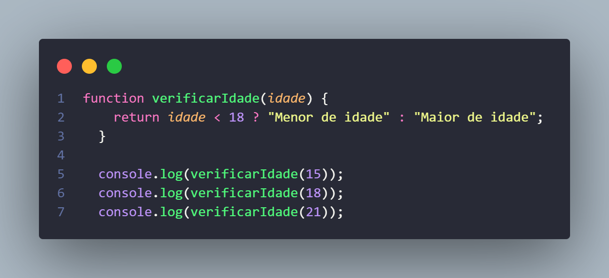
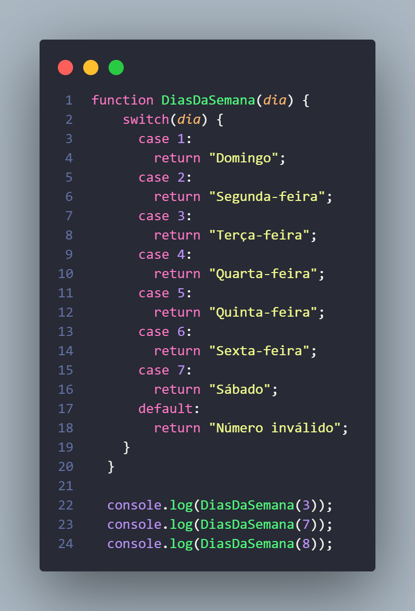
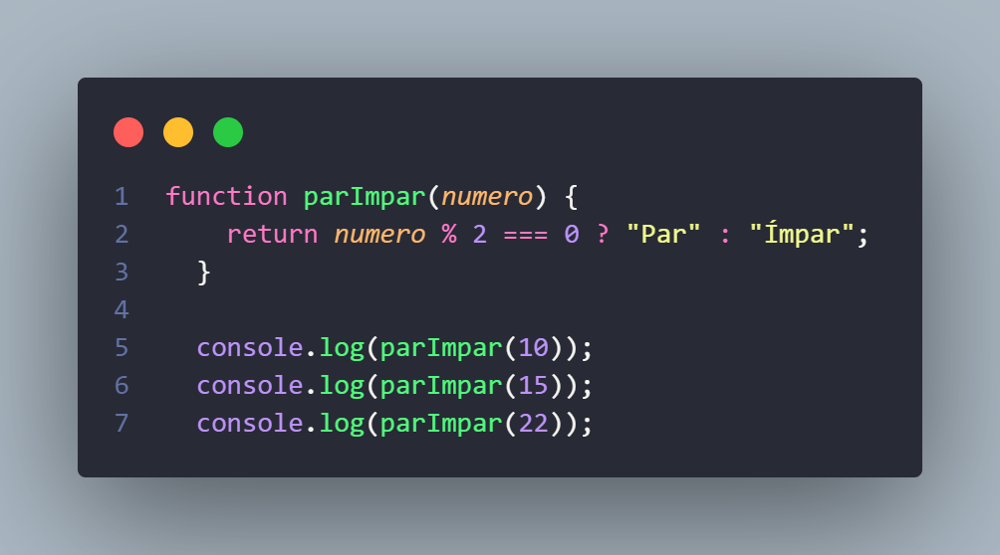
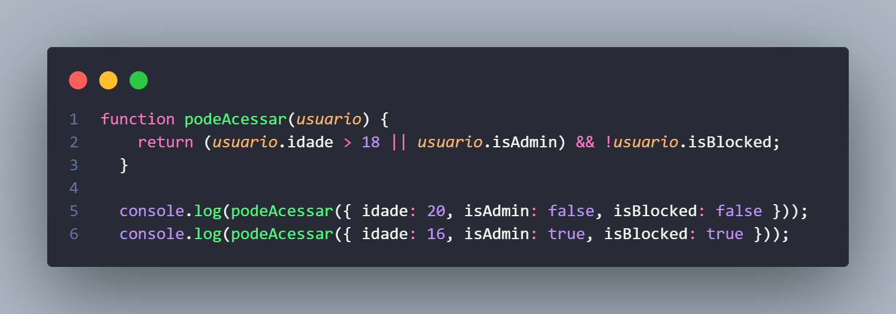
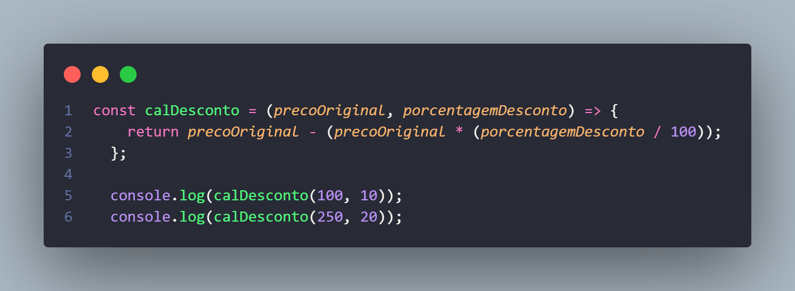

## Exercícios de JavaScript - Condicionais e Funçoes

## Exercício 1: Verificar Idade

Função `verificarIdade`:

- Retorna "Menor de idade" se a idade for menor que 18.
- Retorna "Maior de idade" se a idade for 18 ou mais.

Nesse código, eu criei uma função chamada verificarIdade que recebe um número como parâmetro, representando a idade de uma pessoa. Dentro da função, usei um operador ternário para verificar se a idade é menor que 18.
Se for menor, a função retorna "Menor de idade". Caso contrário, retorna "Maior de idade".
Depois, chamei a função três vezes, passando as idades 15, 18 e 21, e usei o console.log para exibir os resultados.

```javascript
/**
 * Verifica se a idade fornecida corresponde a maior ou menor de idade.
 *
 * @param {number} idade - A idade da pessoa.
 * @returns {string} Retorna "Menor de idade" se a idade for menor que 18, ou "Maior de idade" se a idade for 18 ou mais.
 */
```

<p align="center">
  
</p>

---

## Exercício 2: Definir Dia da Semana

Função `definirDiaDaSemana`:

- Retorna o nome do dia da semana para números de 1 a 7.
- Retorna "Número inválido" se o número for fora do intervalo.

Nesse código, eu criei uma função chamada DiasDaSemana que recebe um número como parâmetro, representando um dia da semana. Usei um switch para verificar o valor do número:

Se for 1, retorna "Domingo", 2 retorna "Segunda-feira", e assim por diante até 7, que retorna "Sábado".
Se o número não estiver entre 1 e 7, a função cai no default e retorna "Número inválido".
Depois, chamei a função três vezes com os números 3, 7 e 8, e usei o console.log para exibir os resultados.

```javascript
/**
 * Retorna o nome do dia da semana correspondente ao número fornecido.
 *
 * @param {number} dia - Um número entre 1 e 7 representando um dia da semana.
 * @returns {string} O nome do dia da semana ou "Número inválido" se o número não for entre 1 e 7.
 */
```

<p align="center">
  
</p>
---

## Exercício 3: Par ou Ímpar

Função `parOuImpar`:

- Retorna "Par" se o número for divisível por 2.
- Retorna "Ímpar" caso contrário.

Nesse código, eu fiz uma função chamada parImpar que verifica se o número passado é par ou ímpar.
Usei a operação de resto da divisão (%) para saber se o número é divisível por 2.

Se o resultado for 0, a função retorna "Par".
Se não for, retorna "Ímpar".
Depois, testei a função com os números 10, 15 e 22, exibindo os resultados no console com o console.log.

```javascript
/**
 * Verifica se um número é par ou ímpar.
 *
 * @param {number} numero - O número a ser verificado.
 * @returns {string} "Par" se o número for par, ou "Ímpar" se for ímpar.
 */
```

<p align="center">
  
</p>
---

## Exercício 4: Verificar Acesso

Função `podeAcessar`:

- Retorna true se:
  1. Idade maior ou igual a 18 OU for administrador.
  2. Conta não estiver bloqueada.
- Retorna false caso contrário.

Nesse código, criei a função podeAcessar que recebe um objeto chamado usuario com as propriedades idade, isAdmin e isBlocked.

Na função, usei condições para verificar:

Se o usuário tem mais de 18 anos OU é administrador (isAdmin).
Se a conta não está bloqueada (!usuario.isBlocked).
A função retorna true se ambas as condições forem atendidas, e false caso contrário.

Depois, testei a função com dois exemplos:

Um usuário de 20 anos com conta ativa (retorna true).
Um usuário administrador com conta bloqueada (retorna false).

```javascript
/**
 * Verifica se um usuário pode acessar o sistema com base em sua idade, status de administrador e se a conta está bloqueada.
 *
 * @param {Object} usuario - Objeto contendo as informações do usuário.
 * @param {number} usuario.idade - A idade do usuário.
 * @param {boolean} usuario.isAdmin - Se o usuário é um administrador.
 * @param {boolean} usuario.isBlocked - Se a conta do usuário está bloqueada.
 * @returns {boolean} Retorna `true` se o acesso for permitido, `false` caso contrário.
 */
```

<p align="center">
  
</p>
---

## Exercício 5: Calcular Desconto

Função `calcularDesconto`:

- Recebe o preço original e a porcentagem de desconto.
- Retorna o preço com o desconto aplicado.

Nesse código, criei uma arrow function chamada calDesconto que calcula o preço de um produto com desconto.
A função recebe dois parâmetros:
precoOriginal: o valor do produto.
porcentagemDesconto: o percentual de desconto a ser aplicado.
Ela retorna o preço final, subtraindo o valor do desconto (precoOriginal \* (porcentagemDesconto / 100)) do preço original.
Depois, testei a função com dois exemplos:
Produto de R$100 com 10% de desconto (retorna 90).
Produto de R$250 com 20% de desconto (retorna 200).

```javascript
/**
 * Calcula o preço de um produto após a aplicação de um desconto.
 *
 * @param {number} precoOriginal - O preço original do produto.
 * @param {number} porcentagemDesconto - A porcentagem de desconto a ser aplicada.
 * @returns {number} O preço do produto com o desconto aplicado.
 */
```

<p align="center">
  
</p>
